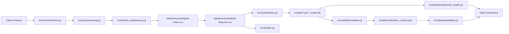

<p align="center">
  
</p>

<h1 align="center">Golden Forecast</h1>

<p align="center">
  <strong>Dashboard predictivo para analizar el precio del oro con Machine Learning, indicadores tecnicos y variables macroeconomicas.</strong>
</p>

<p align="center">
  <a href="https://golden-forecast.onrender.com"><strong>Dashboard en vivo</strong></a> ·
  <a href="docs/index.md"><strong>Documentacion</strong></a> ·
  <a href="docs/ml_report.md"><strong>ML Report</strong></a> ·
  <a href="ROADMAP.md"><strong>Roadmap</strong></a>
</p>

<p align="center">
  
  
  
  
  
  
  
  
  
  
</p>

---

## Vision General

Somos DataScope Solutions, consultora internacional de analisis de datos.
**Golden Forecast** es un proyecto end-to-end de ciencia de datos aplicado al mercado del oro. El sistema descarga datos historicos, limpia y transforma series temporales, genera variables tecnicas y macroeconomicas, entrena modelos supervisados y publica los resultados en un dashboard interactivo construido con Dash y Plotly.

El proyecto esta disenado como una solucion reproducible: incluye configuracion centralizada, datasets procesados, modelos serializados, documentacion tecnica, pruebas automatizadas, contenedorizacion con Docker y despliegue preparado para Render.

> **Aviso**: este proyecto tiene finalidad academica y analitica. No constituye asesoramiento financiero ni una recomendacion de inversion.

## Problema de Negocio

Golden Forecast explora si un modelo supervisado puede anticipar la direccion del precio del oro usando informacion historica, indicadores tecnicos y variables macroeconomicas.

Abordamos el problema desde dos enfoques:

`Clasificacion binaria:` sube (1) o baja (0) al dia siguiente
`Clasificacion multiclase:` comprar (+1%), mantener, vender (<-1%)
`Regresion:` prediccion del retorno esperado (MAE, RMSE, R², MAPE)

## Equipo

| Rol | Nombre |
| --- | --- |
| Product Owner | Maria |
| Scrum Master | Juan |
| Development Team | Jose, Gema, Joel |

## Dataset

Los datos se obtienen con `yfinance` y combinan el precio del oro con indicadores de contexto macro:

| Serie | Ticker | Interpretacion |
| --- | --- | --- |
| Oro | `GC=F` | Activo principal del analisis |
| Dolar estadounidense | `DX-Y.NYB` | Suele tener relacion inversa con el oro |
| Volatilidad | `^VIX` | Proxy de miedo/riesgo de mercado |
| Bono USA 10 anos | `^TNX` | Referencia de tipos de interes |

Los datasets procesados se guardan en `data/processed/`:

- `gold-clean.csv`: dataset limpio y normalizado.
- `gold-features.csv`: dataset final con variables predictoras y targets.
- `predictions.csv`: datset de las prediciones generadas tras la automatizacion.

## Arquitectura



## Pipeline de ML
                                                      
```
extract.py → preprocessing.py → feature_engineering.py → train.py → evaluate.py
     ↓              ↓                    ↓                   ↓           ↓
  Yahoo Finance  Columnas          35 features          12 modelos    Metricas +
  (GC=F, DXY,    limpias           + targets            x 2 targets  Backtest
   VIX, TNX)                                                           + EDA

```

| Etapa | Archivo | Resultado |
| --- | --- | --- |
| Extraccion | `src/extract/extract.py` | Descarga de precios y variables macro |
| Preprocesamiento | `src/preprocessing.py` | Dataset limpio, fechas ordenadas y columnas consistentes |
| Feature engineering | `src/feature_engineering.py` | Retornos, medias moviles, indicadores tecnicos, lags y targets |
| Prediccion | `src/predict.py` | Interfaz de prediccion reutilizable |
| Entrenamiento | `src/models/train.py` | Modelos `.pkl`, `scaler.pkl` y metadata |
| Evaluacion | `src/models/evaluate.py` | Metricas, comparacion de modelos y backtest |
| Visualizacion | `src/dashboard/app.py` | Dashboard web desplegable |

## Modelos Entrenados

El repositorio incluye modelos serializados y artefactos de evaluacion dentro de `models/`.

12 modelos entrenados con split temporal 80/20, para respetar el orden cronologico y reducir el riesgo de leakage.

| Modelo | Algoritmo | Target | F1 (test) | Accuracy |
|--------|-----------|--------|-----------|----------|
| lr_strong_reg_binary | Logistic Regression (C=0.1) | Binario | 0.70 | 56.9% |
| lr_binary | Logistic Regression (C=1.0) | Binario | 0.69 | 56.2% |
| xgb_binary | XGBoost (n=100, d=3) | Binario | 0.67 | 56.5% |
| rf_binary | Random Forest (n=100, d=5) | Binario | 0.66 | 55.2% |
| rf_deep_binary | Random Forest (n=200, d=10) | Binario | 0.62 | 53.6% |
| xgb_deep_binary | XGBoost (n=200, d=5) | Binario | 0.62 | 53.9% |
| lr_multiclass | Logistic Regression | Multiclase | 0.31 | 38.1% |

Metricas de regresion disponibles via dashboard (MAE, RMSE, R², MAPE).|

## Dashboard

Dashboard tematico **Wild-West Saloon** con 8 pestanas:

| Pestana | Contenido |
|---------|-----------|
| **Panel de Control** | Senal del dia, certeza, precio + tendencia, prediccion vs realidad, rendimiento acumulado |
| **Precio** | Grafico historico con RSI, MACD, volatilidad y rango de fechas seleccionable (1D a HIST) |
| **Indicadores** | RSI, MACD, volumen con selector de fechas |
| **Macro** | Correlaciones DXY/VIX/TNX con desplegable explicativo por indicador |
| **Backtest** | Estrategia ML vs Buy & Hold, alpha generado |
| **Simulacion** | Simulador de trading con capital inicial y rango de fechas |
| **Metricas** | Importancia de variables (interactivo por categoria), matriz de confusion, ROC, comparativa modelos |
| **Metodologia** | Pipeline, modelos, equipo, stack, repositorio (QR) |

### Funcionalidades destacadas

- **Selector de unidad** en grafico de precio: USD/oz, % variacion diaria, indexado (base 100)
- **Selector de fechas** (1D, 5D, 1M, 3M, 6M, 1A, HIST) en todos los graficos temporales
- **Importancia de variables** filtrable por categoria (Tecnico, Macro, Precio)
- **Dropdowns explicativos** en pestanas de Macro y Panel de Control
- **Control de volumen** para ambientacion sonora
- **Ticker** con datos en tiempo real del oro, DXY, VIX, MA 21

### Metricas mostradas

| Tipo | Metricas |
|------|----------|
| Clasificacion | Accuracy, Precision, Recall, F1 Score, ROC-AUC |
| Regresion | MAE, RMSE, R², MAPE |
| Backtest | Retorno estrategia, retorno Buy & Hold, Alpha |

### Ejecutar

```bash
pip install -r requirements.txt
python src/dashboard/app.py
# Abrir http://localhost:8050
```

## Stack Tecnico

| Area | Herramientas |
| --- | --- |
| Lenguaje | Python 3.12 |
| Datos | pandas, numpy, yfinance |
| Machine Learning | scikit-learn |
| Visualizacion | Dash, Plotly, CSS |
| Testing | pytest |
| Contenedores | Docker, Docker Compose |
| Despliegue | Render, Gunicorn |
| CI/CD | GitHub Actions |
| Documentacion | Markdown, Mintlify |
| Automatización | Github Actions |

## Estructura del Repositorio

```text
juandelaf1-golden-forecast/
├── README.md
├── docker-compose.yml
├── Dockerfile
├── docs.json
├── mint.json
├── pytest.ini
├── render.yaml
├── requirements.txt
├── ROADMAP.md
├── .dockerignore
├── config/
│   └── pipeline.yaml
├── data/
│   ├── README.md
│   ├── processed/
│   │   ├── gold-clean.csv
│   │   ├── gold-features.csv
│   │   └── .gitkeep
│   └── raw/
│       └── .gitkeep
├── docs/
│   ├── architecture.md
│   ├── data_dictionary.md
│   ├── data_lineage.md
│   ├── decision_log.md
│   ├── index.md
│   ├── ml_report.md
│   ├── project_handbook.md
│   └── screenshots.md
├── models/
│   ├── evaluation_results.json
│   ├── lr_binary.pkl
│   ├── lr_multiclass.pkl
│   ├── lr_strong_reg_binary.pkl
│   ├── lr_strong_reg_multiclass.pkl
│   ├── scaler.pkl
│   ├── train_metadata.json
│   └── .gitkeep
├── notebooks/
│   └── 03_classification.ipynb
├── src/
│   ├── __init__.py
│   ├── feature_engineering.py
│   ├── predict.py
│   ├── preprocessing.py
│   ├── dashboard/
│   │   ├── __init__.py
│   │   ├── app.py
│   │   ├── data.py
│   │   ├── layout.py
│   │   ├── model_loader.py
│   │   └── assets/
│   │       ├── style.css
│   │       └── environment/
│   │           ├── README.md
│   │           ├── dust.js.stub
│   │           ├── generate_with_automatic1111.py
│   │           ├── generation_manifest.json
│   │           ├── glow.js.stub
│   │           ├── negative.txt
│   │           ├── particles.js.stub
│   │           ├── prompt.txt
│   │           └── README_generation.md
│   ├── extract/
│   │   └── extract.py
│   └── models/
│       ├── evaluate.py
│       └── train.py
├── tests/
│   ├── conftest.py
│   ├── test_dashboard.py
│   ├── test_feature_engineering.py
│   └── test_preprocessing.py
└── .github/
    ├── PULL_REQUEST_TEMPLATE.md
    └── workflows/
        ├── ci.yml
        ├── daily_pipeline.yml
        └── mintlify.yml
```

## Archivos Clave

| Archivo | Funcion |
| --- | --- |
| `config/pipeline.yaml` | Configuracion central de rutas, parametros y pipeline |
| `Dockerfile` | Imagen de produccion para ejecutar la app |
| `docker-compose.yml` | Ejecucion local contenedorizada |
| `.dockerignore` | Exclusiones para builds Docker mas limpios |
| `render.yaml` | Configuracion de despliegue en Render |
| `pytest.ini` | Configuracion de pytest |
| `requirements.txt` | Dependencias Python |
| `docs.json` | Configuracion auxiliar de documentacion |
| `mint.json` | Configuracion de documentacion Mintlify |
| `ROADMAP.md` | Plan de evolucion del proyecto |

## CI/CD y Automatizacion

El proyecto incluye workflows en `.github/workflows/`:

| Workflow | Proposito |
| --- | --- |
| `ci.yml` | Lint, tests, build Docker y validacion del contenedor |
| `daily_pipeline.yml` | Automatizacion periodica del pipeline |
| `mintlify.yml` | Publicacion o validacion de documentacion Mintlify |

Tambien incluye una plantilla de Pull Request en `.github/PULL_REQUEST_TEMPLATE.md` para estandarizar revisiones.

## Documentacion

| Documento | Contenido |
| --- | --- |
| `docs/architecture.md` | Arquitectura tecnica |
| `docs/data_dictionary.md` | Diccionario de variables |
| `docs/data_lineage.md` | Linaje de datos |
| `docs/decision_log.md` | Decisiones tecnicas y de producto |
| `docs/index.md` | Entrada principal de documentacion |
| `docs/ml_report.md` | Resultados de modelado |
| `docs/project_handbook.md` | Guia operativa del proyecto |
| `docs/screenshots.md` | Capturas o guia visual del dashboard |
| `data/README.md` | Descripcion de datasets y estructura de datos |

## Como Ejecutar (Pipeline completo)

### 1. Clonar el repositorio

```bash
git clone https://github.com/juandelaf1/Golden-Forecast.git
cd Golden-Forecast
```

### 2. Crear entorno virtual

```bash
python -m venv .venv
source .venv/bin/activate  # Linux/macOS
# .venv\Scripts\activate   # Windows
```

### 3. Instalar dependencias

```bash
python -m pip install --upgrade pip
pip install -r requirements.txt
```

### 4. Ejecutar el dashboard

```bash
python src/dashboard/app.py
```

Abre `http://localhost:8050` en el navegador.

## Ejecutar con Docker

```bash
docker build -t golden-forecast .
docker run -p 8050:8050 golden-forecast
```

O con Docker Compose:

```bash
docker compose up --build
```

## Reproducir el Pipeline

```bash
python src/extract/extract.py # Descargar datos frescos
python src/preprocessing.py
python src/feature_engineering.py
python src/models/train.py 
python src/models/evaluate.py
```

La configuracion principal vive en `config/pipeline.yaml`.

## Tests

```bash
pytest tests/ -v
```

La suite cubre:

- Carga y estructura del dashboard.
- Transformaciones de feature engineering.
- Reglas de preprocesamiento.
- Fixtures compartidas en `tests/conftest.py`.

## Despliegue

El despliegue esta preparado para Render mediante:

- `Dockerfile`: construccion de la imagen.
- `render.yaml`: definicion del servicio.
- `gunicorn`: servidor WSGI para produccion.
- Workflows de GitHub Actions para validar integracion antes del despliegue.

## Gobernanza del Proyecto (SCRUM)

- **Sprint Planning** semanal + Daily Syncs
- **Flujo de trabajo basado en GitHub Flow**: ramas feature/ + PRs con revision por pares
- **Main protegido** (sin pushes directos)
- **Decision Log** en `docs/decision_log.md`
- **Data lineage** en `data/README.md`
- **Conventional Commits**: feat, fix, docs, refactor, chore
- **Pull requests con plantilla dedicada**
- **CI/CD con GitHub Actions**
- **Despliegue Docker en Render**
- **Documentacion tecnica versionada en `docs/`**
- **Configuracion reproducible en `config/pipeline.yaml`**

## Proximos Pasos

- Mejorar validacion temporal con mas ventanas de backtesting.
- Incorporar nuevas variables macro y senales de sentimiento.
- Monitorizar drift de datos y rendimiento del modelo en produccion.

## Roadmap

Ver [ROADMAP.md](ROADMAP.md) para el plan de desarrollo completo.

## Licencia

Proyecto academico desarrollado con fines educativos y no comerciales.
